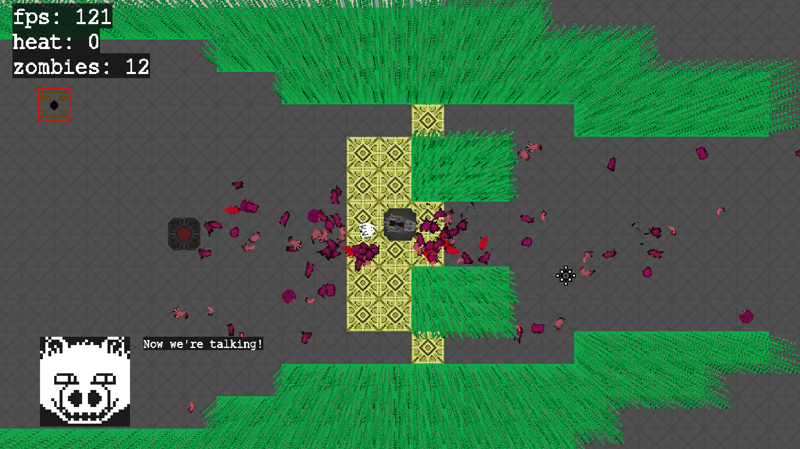

Siege Engine

A 2.5D game engine built with SDL2 and C.
 
 
The pseudo-3D effect is achieved via layering, scaling, and offsetting the "taller" parts of the game world.
 
The parallaxing, scaled-up layers make terrain appear to 'stick out' of the ground.
 
Currently the engine has demo recording/playback, a dialog system with support for animated character portraits,
terrain editing, an easily extensible menu system, collision detection, and support for configurable key bindings!
